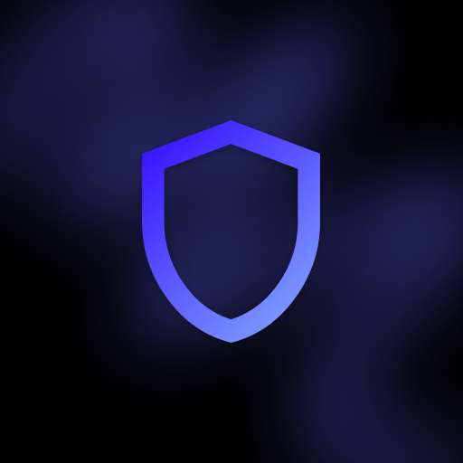

</img>

iqProtect

  
  

  
  
  
  

# ℹ️ Description
## Brief information
> This plugin protects players' buildings and prevents griefers from destroying them! The plugin supports all versions starting from 1.13 and is easy to configure.
## How does this work?
> When a player starts building something, a zone is created around his building in which others are prohibited from breaking and building. The player does not need to do anything, everything is automatic! The zone itself will disappear when the player demolishes the building or the admin removes the zone himself.

# ✨ Features
- Wide compatibility and support for most versions of Minecraft
- Reliable protection from griefers
- Automatic operation of the plugin. The player does not need to enter commands.
- User-friendly GUI
- Only the most necessary commands.
